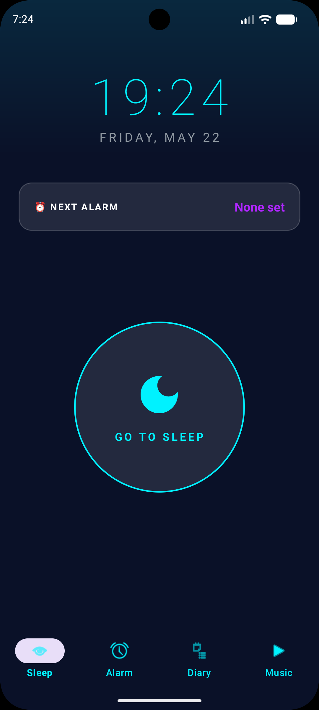
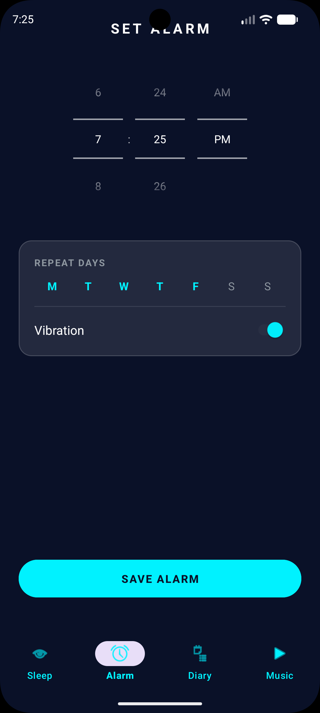
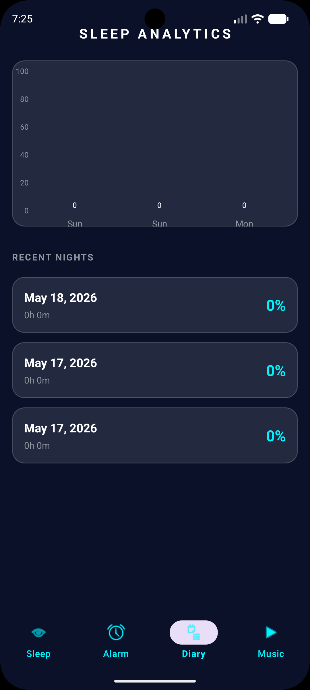
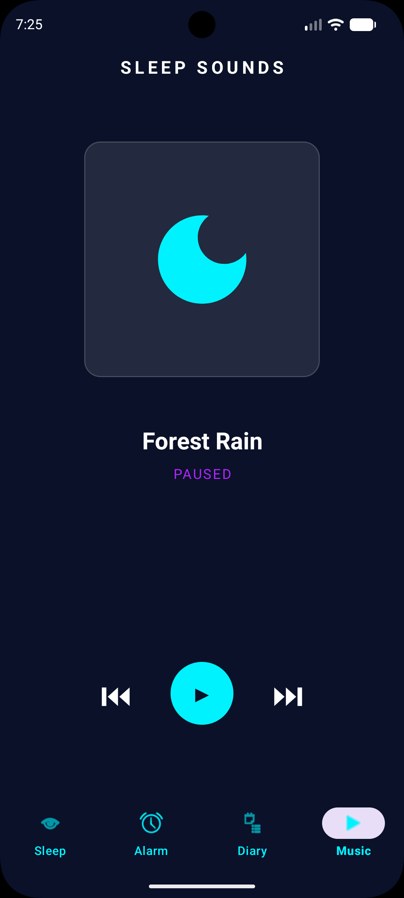

# Circadia 🌙

**Circadia** is a futuristic, minimal, and highly reliable sleep tracking and alarm application for Android. Designed with a sleek neon aesthetic and "glassmorphism" UI, it helps you monitor your sleep patterns and wake up refreshed with intuitive gesture-based controls.

## ✨ Features

- **Futuristic UI/UX**: A dark-mode first design with neon blue and purple accents, featuring translucent "glass" cards and glowing components.
- **Reliable Alarms**: Uses Android's `AlarmClock` API to ensure alarms fire even if the app is closed or the device is in Doze mode.
- **Gesture Controls**:
  - ⬆️ **Swipe Up** to Dismiss the alarm.
  - ⬇️ **Swipe Down** to Snooze for 5 minutes.
- **Sleep Tracking**: Monitors movement during the night using the device's accelerometer to calculate sleep efficiency.
- **Sleep Analytics**: Visualizes your sleep trends over the last 7 days with a clean, modern bar chart.
- **Relaxing Sounds**: Integrated music player with curated sleep sounds (Forest Rain, etc.) to help you drift off.
- **Persistence**: Powered by Room Database for local data storage.

## 📸 Screenshots

| Home (Sleep) | Alarm Settings | Analytics | Music |
| :---: | :---: | :---: | :---: |
|  |  |  |  |

## 🛠️ Tech Stack

- **Language**: Kotlin
- **UI Framework**: XML / View System (Material 3)
- **Database**: Room
- **Background Tasks**: Foreground Services, Coroutines
- **Charting**: MPAndroidChart
- **Architecture**: MVVM (Pattern followed for Fragments/Service)

## 🚀 Getting Started

### Prerequisites

- Android Studio Jellyfish (or newer)
- Android SDK 34+
- A physical device or emulator running Android 8.0 (Oreo) or higher.

### Installation

1. **Clone the repository**:
   ```bash
   git clone https://github.com/YOUR_USERNAME/Circadia.git
   ```
2. **Open in Android Studio**:
   File > Open > Select the `Circadia` folder.
3. **Sync Gradle**:
   Wait for the project to sync dependencies.
4. **Run the app**:
   Connect your device and click the **Run** button (Shift + F10).

## 📄 License

This project is licensed under the Apache License 2.0 - see the [LICENSE](LICENSE) file for details.

---

*Made with ❤️ for better sleep.*
